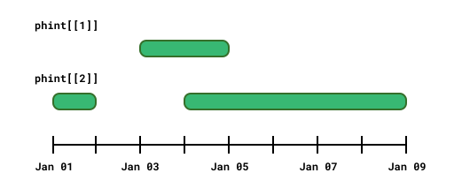
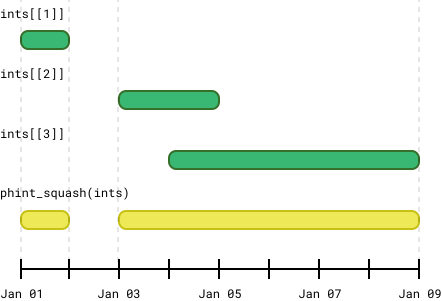

<!-- README.md is generated from README.Rmd. Please edit that file -->

```{r, include = FALSE}
knitr::opts_chunk$set(
  collapse = TRUE,
  comment = "#>",
  fig.path = "man/figures/README-",
  out.width = "100%"
)
```

# phinterval

<!-- badges: start -->

[](https://app.codecov.io/gh/EthanSansom/phinterval)
[](https://lifecycle.r-lib.org/articles/stages.html#experimental)
<!-- badges: end -->

{phinterval} is a package for representing and manipulating time spans that may contain gaps. It implements the `<phinterval>` (think "potentially-holey-interval") vector class, designed as an extension of the [{lubridate}](https://lubridate.tidyverse.org/) `<Interval>`, to represent contiguous, disjoint, empty, and unknown spans of time.

Functionality for manipulating these spans includes:

-   Merging overlapping or adjacent intervals into non-overlapping sets of time spans.
-   Performing set operations: union, intersection, difference, and complement.
-   Testing whether time spans, dates, or times fall within one another or overlap.

## Usage

Each element of a `<phinterval>` vector is a set of non-overlapping and 
non-adjacent intervals. A `<phinterval>` can be created using a list of
`<Interval>` vectors:

```{r}
library(phinterval)
library(lubridate, warn.conflicts = FALSE)

jan_1_to_2 <- interval(as.Date("2000-01-01"), as.Date("2000-01-02"))
jan_3_to_5 <- interval(as.Date("2000-01-03"), as.Date("2000-01-05"))
jan_4_to_9 <- interval(as.Date("2000-01-04"), as.Date("2000-01-09"))
jan_1_to_9 <- interval(as.Date("2000-01-01"), as.Date("2000-01-09"))

phint <- phinterval(
  list(
    jan_3_to_5,
    c(jan_1_to_2, jan_4_to_9)
  )
)
phint
```

Graphically, elements of `phint` look like:

<picture>
<source media="(prefers-color-scheme: dark)" srcset="man/figures/README-/phinterval-dark.svg">
 </picture>

In most cases a `<phinterval>` vector will appear as the result of 
manipulating `<Interval>` vectors. For example, `phint_squash()` flattens
a vector of time spans into a scalar `<phinterval>`.

```{r}
ints <- c(jan_1_to_2, jan_3_to_5, jan_4_to_9)
phint_squash(ints)
```

<picture>
<source media="(prefers-color-scheme: dark)" srcset="man/figures/README-/phint_squash-dark.svg">
 </picture>

## phinterval <-> lubridate

The {phinterval} package treats `<Interval>` vectors as a subclass of
`<phinterval>`, meaning that all {phinterval} functions accept either
`<Interval>` or `<phinterval>` inputs. The table below shows the
{lubridate} functions that have drop-in {phinterval} replacements.

| phinterval                        | lubridate                  |
|-----------------------------------|----------------------------|
| `phint_intersect(phint1, phint2)` | `intersect(x, y)`          |
| `phint_setdiff(phint1, phint2)`   | `setdiff(x, y)`            |
| `phint_union(phint1, phint2)`     | `union(x, y)`              |
| `phint_end(phint)`                | `int_end(int)`             |
| `phint_start(phint)`              | `int_start(int)`           |
| `phint_length(phint)`             | `int_length(int)`          |
| `phint_overlaps(phint1, phint2)`  | `int_overlaps(int1, int2)` |
| `phint_within(x, phint)`          | `a %within% b`             |
| `<phinterval> / <Duration>`       | `<interval> / <Duration>`  |

{phinterval} set operations work as expected with arbitrary time spans, allowing
some operations which are not possible in {lubridate}. For example, the 
intersection of two non-overlapping times is an empty time span, called a `<hole>`.

```{r}
lubridate::intersect(jan_1_to_2, jan_4_to_9)
phint_intersect(jan_1_to_2, jan_4_to_9)
```

The set-difference of a time span and itself is also a `<hole>`.

```{r}
lubridate::setdiff(jan_1_to_2, jan_1_to_2)
phint_setdiff(jan_1_to_2, jan_1_to_2)
```

Set-differences may "punch a hole" through a time span, creating a discontinuous
interval.

```{r}
try(lubridate::setdiff(jan_1_to_9, jan_3_to_5))
phint_setdiff(jan_1_to_9, jan_3_to_5)
```

The union of two disjoint intervals is a single `<phinterval>` containing two spans.

```{r}
lubridate::union(jan_1_to_2, jan_4_to_9)
phint_union(jan_1_to_2, jan_4_to_9)
```

As with the {lubridate} equivalents, all {phinterval} set operations are
vectorized.

```{r}
phint_intersect(
  c(jan_1_to_2, jan_3_to_5, jan_1_to_2),
  c(jan_1_to_9, jan_4_to_9, jan_4_to_9)
)
```

## Installation

You can install the development version of {phinterval} from [GitHub](https://github.com/) with:

``` r
# install.packages("pak")
pak::pak("EthanSansom/phinterval")
```
