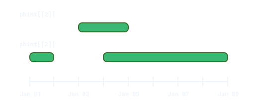
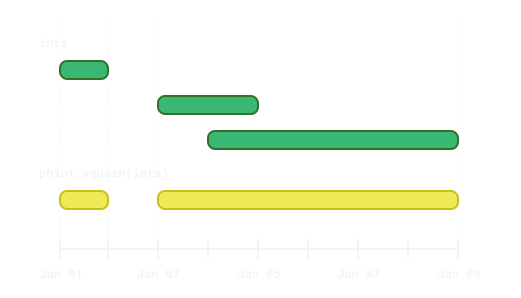

<!-- README.md is generated from README.Rmd. Please edit that file -->

# phinterval 

<!-- badges: start -->

[](https://app.codecov.io/gh/EthanSansom/phinterval)
[](https://lifecycle.r-lib.org/articles/stages.html#experimental)
[](https://github.com/EthanSansom/phinterval/actions/workflows/R-CMD-check.yaml)
<!-- badges: end -->

{phinterval} is a package for representing and manipulating time spans
that may contain gaps. It implements the `<phinterval>` (think
“potentially-holey-interval”) vector class, designed as an extension of
the [{lubridate}](https://lubridate.tidyverse.org/) `<Interval>`, to
represent spans of time that are contiguous, disjoint, empty, or
missing.

Functionality for manipulating these spans includes:

- Merging overlapping or adjacent intervals into non-overlapping sets of
  time spans.
- Performing set operations: union, intersection, difference, and
  complement.
- Testing whether time spans, dates, or times fall within one another or
  overlap.

## Installation

You can install the development version of {phinterval} from
[GitHub](https://github.com/) with:

``` r
# install.packages("pak")
pak::pak("EthanSansom/phinterval")
```

## Usage

Each element of a `<phinterval>` vector is a set of non-overlapping and
non-adjacent intervals. A `<phinterval>` can be created using a list of
`<Interval>` vectors:

``` r
library(phinterval)
library(lubridate, warn.conflicts = FALSE)

jan_1_to_2 <- interval(ymd("2000-01-01"), ymd("2000-01-02"))
jan_3_to_5 <- interval(ymd("2000-01-03"), ymd("2000-01-05"))
jan_4_to_9 <- interval(ymd("2000-01-04"), ymd("2000-01-09"))
jan_1_to_9 <- interval(ymd("2000-01-01"), ymd("2000-01-09"))

phint <- phinterval(
  list(
    jan_3_to_5,
    c(jan_1_to_2, jan_4_to_9)
  )
)
phint
#> <phinterval<UTC>[2]>
#> [1] {2000-01-03--2000-01-05}                        
#> [2] {2000-01-01--2000-01-02, 2000-01-04--2000-01-09}
```

Graphically, the elements of `phint` are represented as:



In most cases, a `<phinterval>` vector will appear as the result of
manipulating `<Interval>` vectors. For example, `phint_squash()`
flattens a vector of time spans into a scalar `<phinterval>`.

``` r
ints <- c(jan_1_to_2, jan_3_to_5, jan_4_to_9)
phint_squash(ints)
#> <phinterval<UTC>[1]>
#> [1] {2000-01-01--2000-01-02, 2000-01-03--2000-01-09}
```

The squashed intervals contain the set of time spans within *any* of the
input intervals, without duplication.



## Example: Employment History

`{phinterval}` is most useful when working with tabular data, such as a
longitudinal employment panel.

``` r
library(dplyr, warn.conflicts = FALSE)

jobs <- tribble(
  ~name,   ~job_title,             ~start,        ~end,
  "Greg",  "Mascot",               "2018-01-01",  "2018-06-03",
  "Greg",  "Executive Assistant",  "2018-06-10",  "2020-04-01",
  "Shiv",  "Political Consultant", "2017-01-01",  "2019-04-01"
)

employment <- jobs |>
  # Squash overlapping/adjacent intervals into a single phinterval
  group_by(name) |>
  summarize(employed = phint_squash(interval(start, end))) |>
  # Invert the employment timeline to find gaps
  mutate(unemployed = phint_invert(employed))

employment
#> # A tibble: 2 × 3
#>   name                                          employed
#>   <chr>                                     <phint<UTC>>
#> 1 Greg  {2018-01-01--2018-06-03, 2018-06-10--2020-04-01}
#> 2 Shiv                          {2017-01-01--2019-04-01}
#> # ℹ 1 more variable: unemployed <phint<UTC>>
```

Formatted `<phinterval>` elements are verbose by default, but can be
truncated using the `phinterval.print_max_width` option for a narrower
display.

``` r
opts <- options(phinterval.print_max_width = 25)
print(employment)
#> # A tibble: 2 × 3
#>   name                  employed               unemployed
#>   <chr>             <phint<UTC>>             <phint<UTC>>
#> 1 Greg                <phint[2]> {2018-06-03--2018-06-10}
#> 2 Shiv  {2017-01-01--2019-04-01}                   <hole>
```

Operations on `<phinterval>` vectors behave like those on standard
intervals. Here, we can see that there was a 7-day gap in Greg’s
employment history:

``` r
employment |>
  mutate(
    days_employed = employed / ddays(1),
    days_unemployed = unemployed / ddays(1)
  ) |>
  select(name, days_employed, days_unemployed)
#> # A tibble: 2 × 3
#>   name  days_employed days_unemployed
#>   <chr>         <dbl>           <dbl>
#> 1 Greg            814               7
#> 2 Shiv            820               0
```

## phinterval \<-\> lubridate

The `<phinterval>` class is a generalization of the `<Interval>` class,
meaning any `<Interval>` can be converted into an equivalent
`<phinterval>` and all {phinterval} functions accept either `<Interval>`
or `<phinterval>` inputs. The table below shows the {lubridate}
functions that have drop-in {phinterval} replacements.

| phinterval              | lubridate            | Returns                       |
|-------------------------|----------------------|-------------------------------|
| `phint_intersect(x, y)` | `intersect(x, y)`    | Times in `x` and `y`          |
| `phint_setdiff(x, y)`   | `setdiff(x, y)`      | Times in `x`, but not in `y`  |
| `phint_union(x, y)`     | `union(x, y)`        | Times in `x` or `y`           |
| `phint_start(x)`        | `int_start(x)`       | The start time of `x`         |
| `phint_end(x)`          | `int_end(x)`         | The end time of `x`           |
| `phint_length(x)`       | `int_length(x)`      | The number of seconds in `x`  |
| `phint_overlaps(x, y)`  | `int_overlaps(x, y)` | Whether `x` and `y` intersect |
| `phint_within(x, y)`    | `x %within% y`       | Whether `y` contains `x`      |
| `x / duration(...)`     | `x / duration(...)`  | How many durations fit in `x` |

{phinterval} set operations work as expected with arbitrary time spans,
enabling operations that are not supported by {lubridate}. For example,
the intersection of two non-overlapping intervals is an empty time span,
called a `<hole>`.

``` r
lubridate::intersect(jan_1_to_2, jan_4_to_9)
#> [1] NA--NA
phint_intersect(jan_1_to_2, jan_4_to_9)
#> <phinterval<UTC>[1]>
#> [1] <hole>
```

The set-difference of a time span and itself is also a `<hole>`.

``` r
lubridate::setdiff(jan_1_to_2, jan_1_to_2)
#> [1] 2000-01-01 UTC--2000-01-02 UTC
phint_setdiff(jan_1_to_2, jan_1_to_2)
#> <phinterval<UTC>[1]>
#> [1] <hole>
```

Performing a set-difference may “punch a hole” in a time span, creating
a discontinuous interval.

``` r
try(lubridate::setdiff(jan_1_to_9, jan_3_to_5))
#> Error in setdiff.Interval(jan_1_to_9, jan_3_to_5) : 
#>   Cases 1 result in discontinuous intervals.
phint_setdiff(jan_1_to_9, jan_3_to_5)
#> <phinterval<UTC>[1]>
#> [1] {2000-01-01--2000-01-03, 2000-01-05--2000-01-09}
```

The union of two disjoint intervals is a single `<phinterval>`
containing two spans.

``` r
lubridate::union(jan_1_to_2, jan_4_to_9)
#> [1] 2000-01-01 UTC--2000-01-09 UTC
phint_union(jan_1_to_2, jan_4_to_9)
#> <phinterval<UTC>[1]>
#> [1] {2000-01-01--2000-01-02, 2000-01-04--2000-01-09}
```

As with the {lubridate} equivalents, all {phinterval} set operations are
vectorized.

``` r
phint_intersect(
  c(jan_1_to_2, jan_3_to_5, jan_1_to_2),
  c(jan_1_to_9, jan_4_to_9, jan_4_to_9)
)
#> <phinterval<UTC>[3]>
#> [1] {2000-01-01--2000-01-02} {2000-01-04--2000-01-05} <hole>
```

## Inspiration

This package is based on the
[{lubridate}](https://lubridate.tidyverse.org/) package’s `<Interval>`
class for representing contiguous time spans. The data structure of the
`<phinterval>` class (a list of matrices) and the C++ implementation of
`phint_squash()` were inspired by the
[{intervals}](https://CRAN.R-project.org/package=intervals) package by
Richard Bourgon and Edzer Pebesma. The figures used in this README and
elsewhere were inspired by the documentation of Davis Vaughan’s
[{ivs}](https://davisvaughan.github.io/ivs/) package.
